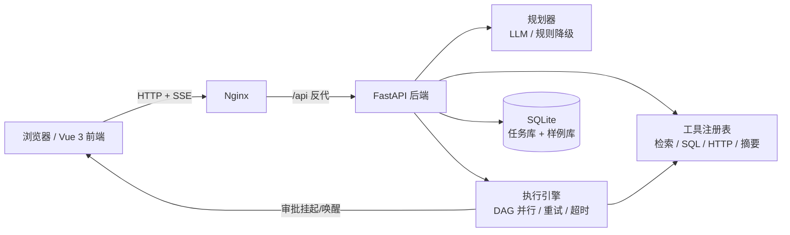
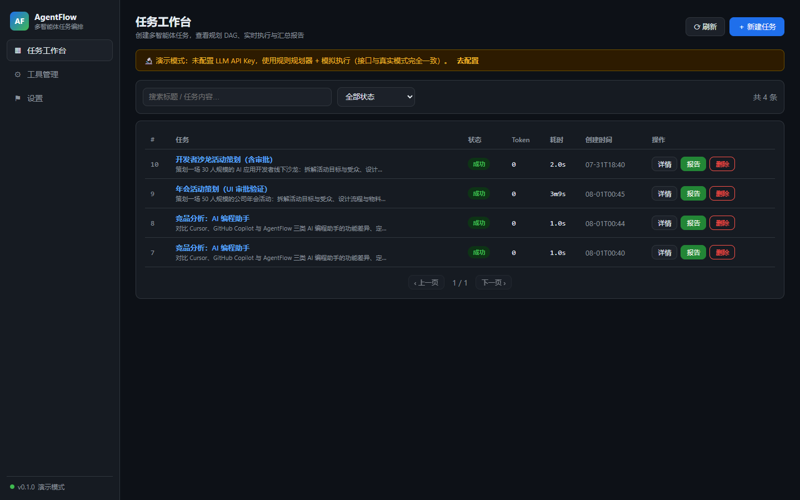
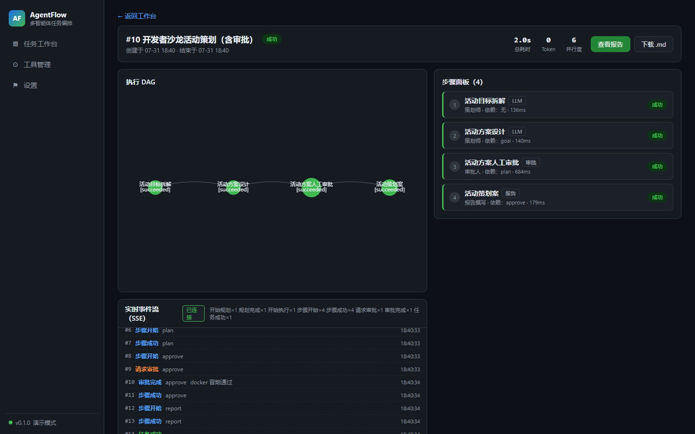

# AgentFlow 多智能体任务编排工作台

把"一句话任务"变成"一组可追踪、可审批、可复盘的多智能体协作流水线"。
> 求职作品集主项目（AI 应用开发工程师）· 需求文档见 [docs/需求开发文档.md](docs/需求开发文档.md)


## 核心能力

- **自然语言规划**：任务输入 → 规划器拆解为子任务 DAG（步骤、角色、依赖、工具）
- **多智能体执行**：规划 / 检索 / 分析 / 审核等角色化 Agent，步骤级重试、超时与并行调度
- **工具调用**：内置工具注册表（检索 / SQL / HTTP / 摘要）+ 可扩展注册，敏感工具需授权
- **人工审批闭环**：敏感节点进入待审批状态，浏览器一键通过 / 拒绝并记录理由
- **可观测复盘**：节点级流式事件、token 与耗时统计、结果溯源（引用），任务失败可回溯重跑
- **无 Key 可演示**：规则规划器 + 模拟执行器降级，内置示例任务，零配置完整体验流程

## 技术栈

Python · FastAPI · SQLite · Vue 3 · Vite · Element Plus · ECharts · Docker · GitHub Actions

## 里程碑

见 [docs/需求开发文档.md](docs/需求开发文档.md) §9：M1 骨架 → M2 编排引擎 → M3 审批与可观测 → M4 前端 → M5 演示与部署 → M6 质量门禁。
## 快速启动

### 本地开发

```powershell
# 后端（conda 环境 agentflow，Python 3.12）
cd backend
python -m uvicorn app.main:app --port 8020

# 前端（另开终端，dev 端口 5176，/api 自动代理到 8020）
cd frontend
npm install
npm run dev
```

### Docker Compose（前后端一体，含 Nginx SPA 回退与 SSE 反代）

```powershell
docker compose up -d --build
# 前端 http://localhost:5176   后端 API http://localhost:8020
```

- 数据持久化：`./data` 挂载为容器 `/data`（任务库 `agentflow.db` + 演示样例库 `demo.db`）
- 端口规划：前端 5176 → Nginx 80；后端 8020；SSE 流已关闭 Nginx 缓冲
- 本机代理受限时构建：compose 已内置 `host.docker.internal:7897` 构建代理参数（npm ci 用），无需额外配置

## 架构



- 前端静态资源由 Nginx 提供（SPA 回退），`/api` 反向代理到后端，SSE 流关闭缓冲实现实时推送
- 数据落盘 `./data`（`agentflow.db` 任务库 + `demo.db` 内置样例库），重启不丢
- 无 LLM Key 时自动降级为规则规划器 + 模拟执行器，接口与真实模式一致

## 演示截图





## 验证

```powershell
# 后端：pytest 全绿 + ruff clean
cd backend && pytest && ruff check .
# 前端：vitest + 生产构建
cd frontend && npm test && npm run build
```

