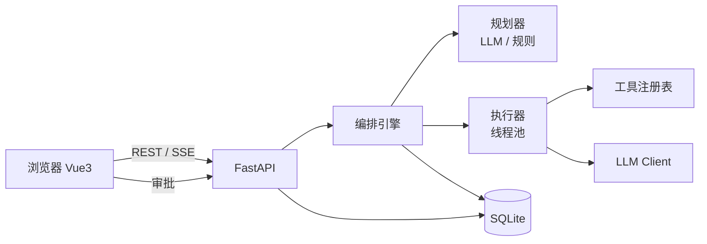

# AgentFlow 多智能体任务编排工作台 — 需求开发文档

## 1. 项目概述

### 1.1 背景与动机
企业里大量任务不是"一次问答"能解决的：写一份竞品分析报告、组织一场活动、排查一次线上故障，都需要"拆解 → 分工 → 执行 → 校验 → 汇总"。现成的 Agent 平台（Coze / Dify）偏黑盒、偏拖拽，很难展示**编排引擎本身的工程能力**。AgentFlow 从零实现一个最小可用的多智能体编排引擎，突出：任务规划、DAG 调度、工具调用、人工审批、流式可观测五个环节。

### 1.2 产品定位（一句话）
把"一句话任务"变成"一组可追踪、可审批、可复盘的多智能体协作流水线"。

### 1.3 目标用户与使用场景
- 求职面试官：浏览器打开即可体验"任务 → 规划 → 多 Agent 执行 → 审批 → 报告"的完整闭环，无需 API Key。
- 学习研究者：观察每个步骤的输入输出、token 消耗、重试与失败原因，理解 Agent 编排的内部机制。
- 轻量用户：把日常多步骤任务（资料收集、报告撰写、数据核对）交给平台，在关键节点人工把关。

### 1.4 成功标准（验收口径）
1. 无 Key 模式（规则规划器 + 模拟执行器）下，内置示例任务可完整跑通并产出可读报告。
2. 有 Key 模式（OpenAI 兼容接口）下，规划与执行使用真实 LLM，且与无 Key 模式接口完全一致。
3. 支持至少 3 个内置工具 + 1 个人工审批节点；审批前执行暂停，审批后继续。
4. 任务执行全程可观测：步骤状态、流式事件、耗时与 token 统计在浏览器实时可见。
5. 全部核心逻辑有自动化测试；后端测试 ≥ 40 项。

### 1.5 范围边界
- 不做：可视化拖拽画布（DAG 由规划器生成，前端只读展示与重排建议）；不实现通用 MCP 服务端（预留工具注册扩展点）。
- 暂不做：多租户、权限体系、任务持久化归档、复杂条件分支（仅支持顺序 + 并行依赖）。

## 2. 名词与术语

| 术语 | 说明 |
| --- | --- |
| Run（任务运行） | 一次任务的完整执行实例，包含规划结果与全部步骤 |
| Step（执行步骤） | 任务内的最小执行单元，具有角色、工具或 LLM 类型、状态与产物 |
| Planner（规划器） | 把任务输入拆解为步骤 DAG 的组件，LLM 或规则实现 |
| Executor（执行器） | 调度并执行步骤的引擎，负责并行、重试、超时 |
| Tool（工具） | 步骤可调用的能力单元，注册在工具表中 |
| Approval（审批） | 敏感步骤进入的暂停状态，人工确认后继续 |
| Event（事件） | 运行/步骤级流式日志，供前端实时展示 |

## 3. 功能需求

### 3.1 功能总览
- FR-01 任务创建与管理
- FR-02 任务规划（LLM + 规则降级）
- FR-03 步骤执行引擎（调度 / 重试 / 超时）
- FR-04 工具注册与调用
- FR-05 人工审批
- FR-06 可观测与复盘
- FR-07 报告汇总与导出
- FR-08 演示模式（无 Key）
- FR-09 模型与系统设置
- FR-10 数据管理

### 3.2 FR-01 任务创建与管理
- 用户提交任务文本（≤ 4000 字）与可选约束（模型、并行度、是否允许敏感工具）。
- 任务状态机：`pending → planning → running → waiting_approval ⇄ running → succeeded / failed / cancelled`。
- 支持列表（分页 / 状态筛选）、详情（含步骤与事件）、取消（仅 running 前）、删除。

### 3.3 FR-02 任务规划
- 输入任务文本，输出步骤 DAG：`steps[{id, name, role, kind(llm|tool|approval|report), tool, prompt, depends_on[]}]`。
- 有 Key：LLM 按 JSON Schema 输出规划；解析失败自动重试 1 次，仍失败降级规则规划器。
- 无 Key：规则规划器按内置模板（竞品分析 / 活动策划 / 故障排查 / 数据核对）拆解步骤。
- 规划结果落库并作为执行输入，前端展示 DAG 预览（可查看，不可编辑）。

### 3.4 FR-03 步骤执行引擎
- 按依赖关系调度：入度为 0 的步骤并行执行，其余依赖完成后触发。
- 每步支持：最大尝试次数（默认 3）、超时（默认 120s）、失败重试（指数退避）。
- LLM 步骤：调用 OpenAI 兼容 chat/completions，支持结构化输出校验（JSON Schema / 必填字段）。
- 工具步骤：从工具表解析参数，执行并校验结果；工具失败视为步骤失败。
- 执行线程池隔离（默认 4），避免阻塞事件循环；全程写事件流。

### 3.5 FR-04 工具注册与调用
- 内置工具：`web_search`（检索，演示模式返回样例）、`sql_query`（查询内置 SQLite 样例库）、`http_request`（GET 白名单域名）、`summarize`（文本摘要）、`approve`（人工审批节点）。
- 工具表字段：key、名称、描述、参数 JSON Schema、是否内置、是否敏感（敏感工具需审批前置）。
- 支持新增自定义工具（非内置）：仅存储参数定义，执行器按定义调用。

### 3.6 FR-05 人工审批
- `approve` 步骤进入 `waiting_approval`，运行状态同步为 `waiting_approval`。
- 前端可查看审批上下文（输入、理由、风险提示）并执行 通过 / 拒绝（附理由）。
- 通过 → 步骤继续；拒绝 → 步骤失败并跳过下游（除非下游声明 `on_reject=continue`）。

### 3.7 FR-06 可观测与复盘
- 事件流：run 级与 step 级事件（开始 / 结束 / 重试 / 审批 / 错误），按 seq 自增，支持 SSE 增量推送。
- 统计：每步 token 输入 / 输出、耗时 ms、尝试次数；运行汇总展示。
- 失败步骤记录错误与上下文摘要；支持"以此步骤为起点重跑"（M5 可选）。

### 3.8 FR-07 报告汇总与导出
- 全部步骤成功后，汇总步骤（kind=report）或引擎自动聚合各步骤结论，生成 Markdown 报告。
- 报告引用各步骤产物（引用跳转），支持复制与导出 .md 文件。

### 3.9 FR-08 演示模式（无 Key）
- 未配置 API Key 时：规则规划器 + 模拟执行器（内置示例数据），接口与真实模式完全一致。
- 内置示例任务：竞品分析、活动策划、故障排查、数据核对，一键加载。
- 健康检查上报 `capabilities.llm=false`，前端展示"演示模式"标识。

### 3.10 FR-09 模型与系统设置
- 设置项：模型名、Base URL、API Key（写时不回显）、温度、max tokens、并行度、超时、重试次数。
- 设置持久化于 settings 表，启动时读取；测试环境通过环境变量覆盖。

### 3.11 FR-10 数据管理
- 清空全部业务数据（保留表结构与内置工具）；日志按日期滚动，保留 7 天。

## 4. 非功能需求
- 性能：步骤调度 O(n) 内存判断，千步以内任务不卡顿；并行度可配置。
- 安全：工具域名白名单；API Key 不回显；媒体/文件路径防穿越；审批为唯一的外部副作用出口。
- 可靠：步骤幂等设计（重试不重复副作用）；服务重启将遗留 running 任务标记为 failed。
- 可观测：结构化日志（loguru）+ 事件流；所有写操作可回滚（SQLite 事务）。
- 可部署：Docker Compose + Nginx 同源；前端构建产物由 FastAPI 托管，SPA fallback。

## 5. 系统架构

### 5.1 总体架构


### 5.2 模块划分与职责
| 模块 | 职责 |
| --- | --- |
| app/api | REST 路由：runs / steps / tools / settings / health / events(SSE) |
| app/services/planner | 任务 → 步骤 DAG（LLM 优先，规则降级） |
| app/services/executor | DAG 调度、并行、重试、超时、审批暂停 |
| app/services/tools | 工具注册与内置工具实现（检索 / SQL / HTTP / 摘要 / 审批） |
| app/llm | OpenAI 兼容客户端（对话 / 结构化输出，测试可 mock） |
| app/storage | SQLite DAO（runs / steps / events / tools / settings） |
| app/utils | 日志、限流、时间、文本工具 |

### 5.3 技术选型与理由
- Python + FastAPI：与 DocMind 同栈，异步 + 线程池兼顾编排引擎与 IO。
- SQLite：零运维、事务可靠，适合演示规模；表结构见 §6.2。
- Vue 3 + Element Plus + ECharts：DAG 图、状态流、统计卡片复用现有作品集风格。
- SSE 而非 WebSocket：单向日志流场景更简单，天然断线重连。

### 5.4 核心流程
1. 创建 Run（pending）→ 触发规划任务。
2. 规划器产出步骤 DAG 并落库 → 状态 planning → running。
3. 执行器按依赖调度步骤：LLM 步骤调模型；工具步骤查工具表；approve 步骤挂起。
4. 审批通过后继续；全部步骤完成 → 汇总报告 → succeeded。
5. 任一关键步骤失败 → 按重试策略处理；重试耗尽 → failed，保留全部事件与产物。

## 6. 数据设计

### 6.1 实体关系
Run 1—N Step；Run 1—N Event；Step 1—N Event；Step N—1 Tool；Run 1—N Approval。

### 6.2 表结构（SQLite DDL）
```sql
CREATE TABLE runs (
  id INTEGER PRIMARY KEY AUTOINCREMENT,
  title TEXT NOT NULL,
  input_text TEXT NOT NULL,
  status TEXT NOT NULL DEFAULT 'pending',
  plan_json TEXT,
  report TEXT,
  error TEXT,
  total_tokens INTEGER DEFAULT 0,
  total_duration_ms INTEGER,
  created_at TEXT NOT NULL,
  updated_at TEXT NOT NULL,
  finished_at TEXT
);

CREATE TABLE steps (
  id INTEGER PRIMARY KEY AUTOINCREMENT,
  run_id INTEGER NOT NULL REFERENCES runs(id) ON DELETE CASCADE,
  step_key TEXT NOT NULL,          -- 规划器生成的唯一键，如 s1
  seq INTEGER NOT NULL,
  name TEXT NOT NULL,
  role TEXT NOT NULL,
  kind TEXT NOT NULL,              -- llm | tool | approval | report
  tool_key TEXT,
  prompt TEXT,
  depends_on TEXT NOT NULL DEFAULT '[]',
  status TEXT NOT NULL DEFAULT 'pending',
  input_json TEXT,
  output_json TEXT,
  citations_json TEXT,
  tokens_in INTEGER DEFAULT 0,
  tokens_out INTEGER DEFAULT 0,
  duration_ms INTEGER,
  attempts INTEGER DEFAULT 0,
  error TEXT,
  created_at TEXT NOT NULL,
  updated_at TEXT NOT NULL,
  finished_at TEXT
);
CREATE INDEX idx_steps_run ON steps(run_id, seq);

CREATE TABLE events (
  id INTEGER PRIMARY KEY AUTOINCREMENT,
  run_id INTEGER NOT NULL REFERENCES runs(id) ON DELETE CASCADE,
  step_id INTEGER REFERENCES steps(id) ON DELETE CASCADE,
  seq INTEGER NOT NULL,
  type TEXT NOT NULL,              -- run_start | step_start | step_done | retry | approval | error | run_done ...
  payload_json TEXT,
  created_at TEXT NOT NULL
);
CREATE INDEX idx_events_run ON events(run_id, seq);

CREATE TABLE tools (
  id INTEGER PRIMARY KEY AUTOINCREMENT,
  key TEXT UNIQUE NOT NULL,
  name TEXT NOT NULL,
  description TEXT,
  params_json TEXT NOT NULL DEFAULT '{}',
  sensitive INTEGER NOT NULL DEFAULT 0,
  is_builtin INTEGER NOT NULL DEFAULT 0,
  created_at TEXT NOT NULL
);

CREATE TABLE approvals (
  id INTEGER PRIMARY KEY AUTOINCREMENT,
  run_id INTEGER NOT NULL,
  step_id INTEGER NOT NULL REFERENCES steps(id) ON DELETE CASCADE,
  action TEXT,                     -- approve | reject
  reason TEXT,
  created_at TEXT NOT NULL
);

CREATE TABLE settings (
  key TEXT PRIMARY KEY,
  value_json TEXT NOT NULL
);
```

### 6.3 关键 JSON 结构
- plan_json：`{"steps":[{"key":"s1","name":"收集竞品信息","role":"researcher","kind":"tool","tool":"web_search","params":{...},"depends_on":[]}, ...]}`
- 步骤输出：`{"content":"...", "citations":[{"title":"...","url":"..."}]}`

## 7. 接口设计

### 7.1 通用约定
- 前缀 `/api`，JSON 响应；错误统一 `{detail}`（FastAPI 默认）。
- 分页：`page` / `page_size`，响应 `{total, items}`。

### 7.2 接口清单
| 方法 | 路径 | 说明 |
| --- | --- | --- |
| GET | /api/health | 健康检查 + capabilities |
| GET/PUT | /api/settings | 读写系统设置 |
| GET | /api/tools | 工具列表（内置 + 自定义） |
| POST | /api/tools | 注册自定义工具 |
| POST | /api/runs | 创建任务（M1 仅建记录；M2 起触发规划） |
| GET | /api/runs | 任务列表（分页 / 状态筛选） |
| GET | /api/runs/{id} | 任务详情（含 steps） |
| POST | /api/runs/{id}/start | 启动执行（M2 实现） |
| POST | /api/runs/{id}/cancel | 取消运行 |
| DELETE | /api/runs/{id} | 删除任务 |
| GET | /api/runs/{id}/events?after=seq | 增量事件 |
| POST | /api/steps/{step_id}/approve | 审批通过 / 拒绝 |
| GET | /api/reports/{run_id} | 报告导出（.md） |

### 7.3 关键接口详述
- `POST /api/runs`：body `{title, input_text, parallel?, allow_sensitive?}` → `201 {run}`。
- `GET /api/runs/{id}`：`{run, steps[]}`；steps 含状态、耗时、tokens、输出摘要（长文本截断）。
- `POST /api/steps/{id}/approve`：body `{action: "approve"|"reject", reason?}`；仅 `waiting_approval` 步骤可审批。

### 7.4 SSE 事件协议
`GET /api/runs/{id}/events/stream`：`data: {"seq":12,"type":"step_done","step_id":3,"payload":{...}}`；事件类型见 events 表注释。

## 8. 前端设计

### 8.1 设计原则
延续 DocMind 设计令牌（深色信息密度 + 浅色主界面均可），突出"过程可见"：任务卡片 → DAG 视图 → 步骤详情 → 事件流四层下钻。

### 8.2 页面结构
- 任务工作台（列表 + 新建任务对话框 + 示例任务）
- 任务详情（顶部状态条：耗时 / token / 并行度；中部 DAG 图；右侧步骤面板 + 实时事件流）
- 工具管理（内置 / 自定义工具表格 + 注册对话框）
- 设置页（模型 / 执行参数 / 数据管理）

### 8.3 技术要点
- DAG 用 ECharts 自定义 series 或 SVG 布局（依赖线 + 状态色）。
- SSE 通过 `EventSource` 消费，断线自动重连；增量用 `after=seq` 兜底。
- 审批节点高亮 + 弹窗上下文（输入 / 风险提示 / 理由输入）。
- 报告页 Markdown 渲染 + 引用跳转到对应步骤。

## 9. 里程碑规划（无时间线）

- **M1 项目骨架与工程基线**：配置 / 模型 / SQLite DAO / 健康与设置 API / 工具与任务 CRUD；后端测试 ≥ 15 项；ruff + pytest 门禁。
- **M2 编排引擎**：规划器（LLM + 规则降级）、执行器（依赖调度 / 重试 / 超时 / 线程池）、内置工具实现、LLM 客户端 mock 测试。
- **M3 审批与可观测**：approve 步骤、审批 API、SSE 事件流、token 与耗时统计。
- **M4 前端完整实现**：任务工作台、DAG 可视化、事件流、审批交互、报告页；生产构建通过。
- **M5 演示与部署**：内置示例任务、演示模式打磨、Docker Compose + Nginx、GitHub Actions。
- **M6 质量门禁**：端到端测试、失败场景演练、代码审查与 README 复盘。

## 10. 测试策略

### 10.1 测试层级
- 单元：规划器（规则模板 / LLM JSON 解析失败降级）、调度器（依赖 / 并行 / 重试 / 超时）、工具（参数校验 / 白名单）。
- 集成：API 全链路（创建 → 启动 → 事件 → 审批 → 报告）；LLM 用 mock 客户端。
- 门禁：pytest 全绿 + ruff clean + 前端 `npm run build`。

### 10.2 关键测试用例
1. 无 Key 模式下规则规划器对四类示例任务输出合法 DAG。
2. LLM 规划输出非法 JSON → 自动重试 → 降级规则规划器。
3. 依赖链步骤按序执行；无依赖步骤并行（时间上可重叠）。
4. 工具失败重试 3 次后任务 failed，事件流包含 retry 与 error。
5. approve 步骤挂起 → 拒绝后下游跳过 → failed。
6. 审批通过后继续执行并产出报告。
7. SSE 增量协议：after=seq 不重不漏。
8. 服务重启后遗留 running 任务标记 failed。

### 10.3 测试数据与 Fixture
- `tests/fixtures`：示例任务文本、规则模板、mock LLM 响应、内置工具样例数据。
